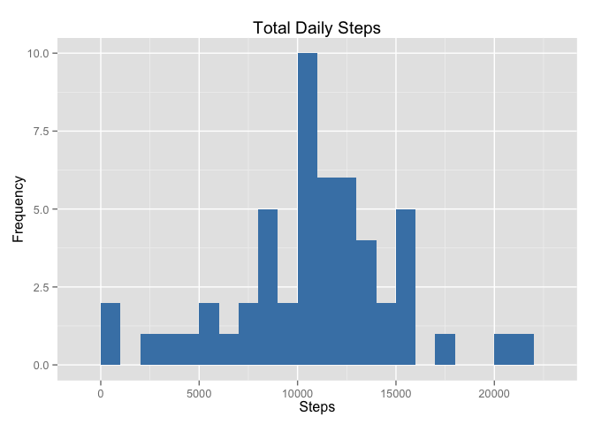
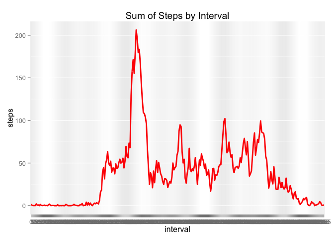
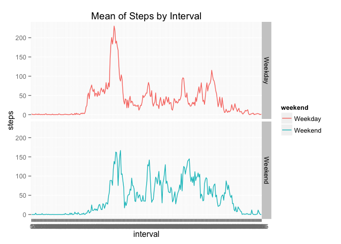

# Reproducible Research: Peer Assessment 1


```r
library(ggplot2)
baseData <- read.csv("activity.csv")
```


```r
baseData$date <- as.Date(as.character(baseData$date))
baseData$interval <- as.factor(baseData$interval)

baseDataNA <- is.na(baseData$steps)

cleanBase <- baseData[!baseDataNA,]
```

# What is mean total number of steps taken per day?
1. Calculate the total number of steps taken per day

```r
SummedDataByDay <- aggregate(baseData$steps, by=list(baseData$date), sum)
```

```r
names(SummedDataByDay)[1] ="date"
names(SummedDataByDay)[2] ="totalsteps"
```

```r
head(SummedDataByDay,15)
```

```
##          date totalsteps
## 1  2012-10-01         NA
## 2  2012-10-02        126
## 3  2012-10-03      11352
## 4  2012-10-04      12116
## 5  2012-10-05      13294
## 6  2012-10-06      15420
## 7  2012-10-07      11015
## 8  2012-10-08         NA
## 9  2012-10-09      12811
## 10 2012-10-10       9900
## 11 2012-10-11      10304
## 12 2012-10-12      17382
## 13 2012-10-13      12426
## 14 2012-10-14      15098
## 15 2012-10-15      10139
```

2. Make a histogram of the total number of steps taken each day

```r
ggplot(SummedDataByDay, aes(x = totalsteps)) +
  geom_histogram(fill = "steelblue", binwidth=1000) +
  labs(title = "Total Daily Steps", x = "Steps", y = "Frequency")
```

<!-- -->

3. Calculate and report the mean and median of the total number of steps taken per day

```r
mean(SummedDataByDay$totalsteps,na.rm=TRUE)
```

```
## [1] 10766.19
```

```r
median(SummedDataByDay$totalsteps,na.rm=TRUE)
```

```
## [1] 10765
```

# What is the average daily activity pattern?
1. Make a time series plot of the 5-minute interval (x-axis) and the average number of steps taken, averaged across all days (y-axis)


```r
nonNASubset <- baseData[!baseDataNA,]
MeanDataByInterval <- aggregate(nonNASubset$steps, by=list(nonNASubset$interval), mean)

names(MeanDataByInterval)[1] ="interval"
names(MeanDataByInterval)[2] ="steps"

ggplot(MeanDataByInterval, aes(x = interval, y=steps, group = 1)) +
  labs(title = "Sum of Steps by Interval", x = "interval", y = "steps")+
  geom_line(color="red", size = 1) 
```

<!-- -->

2. Which 5-minute interval, on average across all the days in the dataset, contains the maximum number of steps?

```r
maxInterval <- MeanDataByInterval[which.max(MeanDataByInterval$steps),]
maxInterval
```

```
##     interval    steps
## 104      835 206.1698
```


# Imputing missing values
1. Calculate and report the total number of missing values in the dataset (i.e. the total number of rows with NAs)

```r
missingVals <- sum(baseDataNA)
missingVals
```

```
## [1] 2304
```

2. Devise a strategy for filling in all of the missing values in the dataset.

Strategy: Use mean interval steps from Mean Steps for that interval.

3. Create a new dataset that is equal to the original dataset but with the missing data filled in.

```r
baseData2 <- baseData
# dataset minus NA's for Mean calculation
NABase2 <- baseData2[is.na(baseData2$steps),]
cleanBase2 <- baseData2[!is.na(baseData2$steps),]
# generate Mean Data2 by interval
MeanData2ByInterval <- aggregate(cleanBase2$steps, by=list(cleanBase2$interval), sum)
names(MeanData2ByInterval)[1] ="interval"
names(MeanData2ByInterval)[2] ="steps"
# IMPUT METHOD- ATTEMPT 2
baseData2 <- baseData
missingData <- is.na(baseData2$steps)
meanVals <- tapply(cleanBase$steps, cleanBase$interval, mean, na.rm=TRUE, simplify=TRUE)
baseData2$steps[missingData] <- meanVals[as.character(baseData2$interval[missingData])]
# original missing data count
sum(missingData)
```

```
## [1] 2304
```

```r
# count of NA values
sum(is.na(baseData2$steps))
```

```
## [1] 0
```

4a) Make a histogram of the total number of steps taken each day and Calculate and report the mean and median total number of steps taken per day.

```r
FullSummedDataByDay <- aggregate(baseData2$steps, by=list(baseData2$date), sum)

names(FullSummedDataByDay)[1] ="date"
names(FullSummedDataByDay)[2] ="totalsteps"
head(FullSummedDataByDay,15)
```

```
##          date totalsteps
## 1  2012-10-01   10766.19
## 2  2012-10-02     126.00
## 3  2012-10-03   11352.00
## 4  2012-10-04   12116.00
## 5  2012-10-05   13294.00
## 6  2012-10-06   15420.00
## 7  2012-10-07   11015.00
## 8  2012-10-08   10766.19
## 9  2012-10-09   12811.00
## 10 2012-10-10    9900.00
## 11 2012-10-11   10304.00
## 12 2012-10-12   17382.00
## 13 2012-10-13   12426.00
## 14 2012-10-14   15098.00
## 15 2012-10-15   10139.00
```

```r
# Plot using ggplot
ggplot(FullSummedDataByDay, aes(x = totalsteps)) +
  geom_histogram(fill = "steelblue", binwidth=1000) +
  labs(title = "Total Daily Steps", x = "Steps", y = "Frequency")
```

<!-- -->

```r
# Mean on New Data
mean(FullSummedDataByDay$totalsteps)
```

```
## [1] 10766.19
```

```r
# Median on New Data
median(FullSummedDataByDay$totalsteps)
```

```
## [1] 10766.19
```

4b) Do these values differ from the estimates from the first part of the assignment?

Yes, the mean remains the same as 10766.19 but the median has risen 1.19 steps, from 10765 to 10766.19.

4c) What is the impact of imputing missing data on the estimates of the total daily number of steps?

The effect of using mean data per interval as a data impute method for missing values seems to push overall data towards the mean.

# Are there differences in activity patterns between weekdays and weekends?

```r
baseData2$weekday <- weekdays(baseData2$date)
baseData2$weekend <- ifelse (baseData2$weekday == "Saturday" | baseData2$weekday == "Sunday", "Weekend", "Weekday")
#baseData2$weekend <- as.factor(baseData2$weekend)
head(baseData2,5)
```

```
##       steps       date interval weekday weekend
## 1 1.7169811 2012-10-01        0  Monday Weekday
## 2 0.3396226 2012-10-01        5  Monday Weekday
## 3 0.1320755 2012-10-01       10  Monday Weekday
## 4 0.1509434 2012-10-01       15  Monday Weekday
## 5 0.0754717 2012-10-01       20  Monday Weekday
```

```r
MeanDataWeekendWeekday <- aggregate(baseData2$steps, by=list(baseData2$weekend, baseData2$interval), mean)
names(MeanDataWeekendWeekday)[1] ="weekend"
names(MeanDataWeekendWeekday)[2] ="interval"
names(MeanDataWeekendWeekday)[3] ="steps"

ggplot(MeanDataWeekendWeekday, aes(x = interval, y=steps, color=weekend, group = 1)) +
  geom_line() +
  facet_grid(weekend ~ .) +
  labs(title = "Mean of Steps by Interval", x = "interval", y = "steps")
```

<!-- -->

There seems to be variation in the beginning of the day during weekdays, likely due to workplace activities. There seems to be an overall slightly larger incidence of steps during the weekends.


